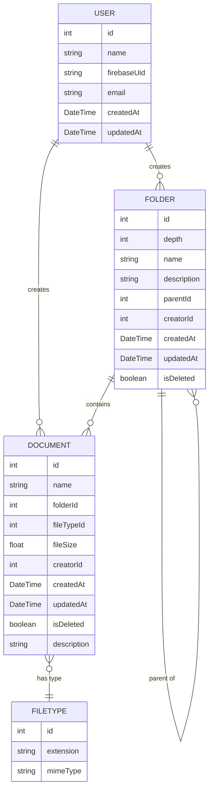

This is the database schema for Document Manager
Compatible with common databases like MYSQL or PostgreSQL

```mermaid
erDiagram
    USER ||--o{ DOCUMENT : "creates"
    USER ||--o{ FOLDER : "creates"
    FOLDER ||--o{ DOCUMENT : "contains"
    FOLDER ||--o{ FOLDER : "parent of"
    DOCUMENT }o--|| FILETYPE : "has type"

    USER {
        int id
        string name
        string firebaseUid
        string email
        DateTime createdAt
        DateTime updatedAt
    }

    FOLDER {
        int id
        int depth
        string name
        string description
        int parentId
        int creatorId
        DateTime createdAt
        DateTime updatedAt
        boolean isDeleted
    }

    FILETYPE {
        int id
        string extension
        string mimeType
    }

    DOCUMENT {
        int id
        string name
        int folderId
        int fileTypeId
        float fileSize
        int creatorId
        DateTime createdAt
        DateTime updatedAt
        boolean isDeleted
        string description
    }

```
